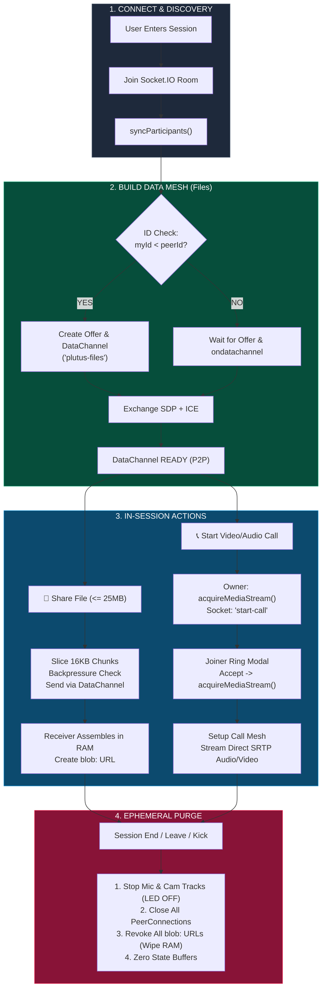
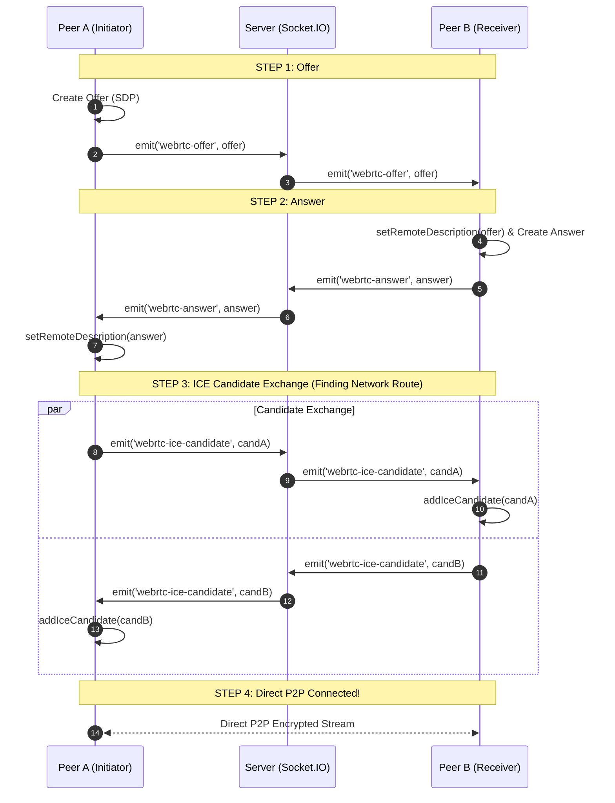
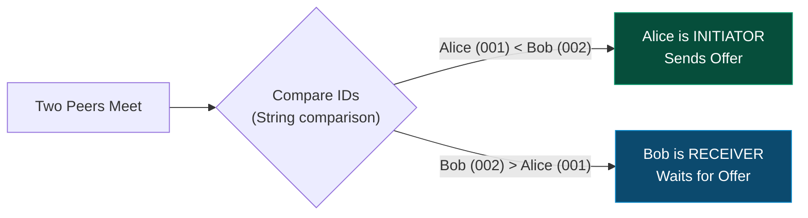
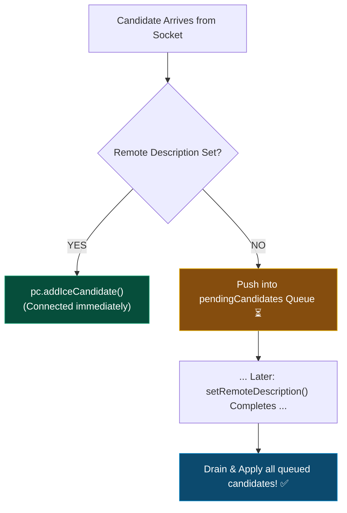
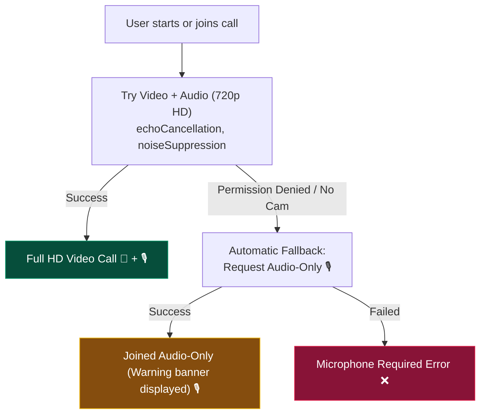
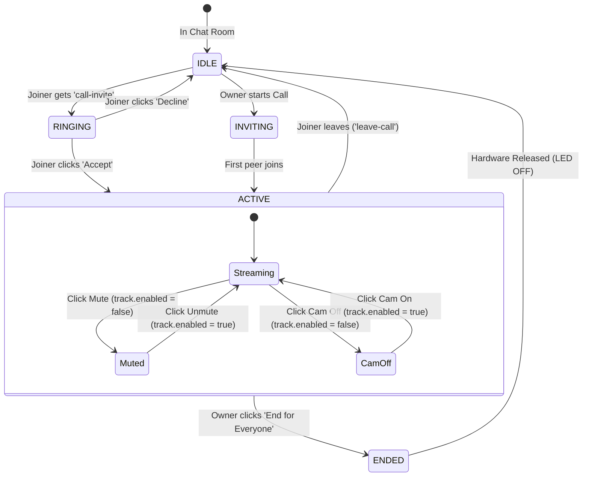
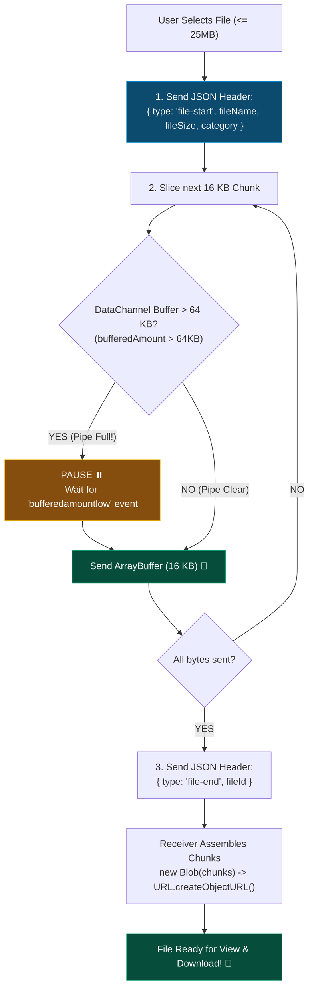
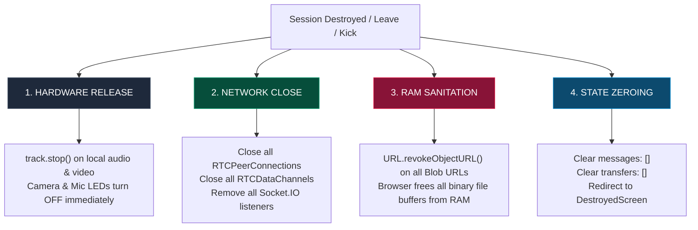

# 🌐 WebRTC Visual Architecture Guide
**Plutus Ephemeral Secure Communication Line — Visual Cheat-Sheet**

---

## ⚡ 1. The Core Concept in 10 Seconds

> 💡 **Analogy:** The **Signaling Server** is like a matchmaker who introduces two people. Once they exchange phone numbers, the matchmaker leaves the room—all communication is **100% direct (Peer-to-Peer)**.

```
       ┌────────────────────────────────────────────────────────┐
       │             Socket.IO Signaling Server                 │
       │    (Only introduces peers; never touches media/files)  │
       └──────────────┬──────────────────────────┬──────────────┘
         Signaling:   │ Offers / Answers / ICE   │  Signaling:
         SDP & ICE    ▼                          ▼  SDP & ICE
                 ┌──────────┐              ┌──────────┐
                 │ Client A │◄────────────►│ Client B │
                 │ (Browser)│  Direct P2P  │ (Browser)│
                 └──────────┘  Encrypted   └──────────┘
                               Media & Files
```

| ❌ What the Server Sees | ✅ What Peers See (Direct P2P) |
| :--- | :--- |
| • Connection metadata (SDP) | • Live HD Video & Voice audio |
| • IP/Port candidates (ICE) | • File contents (Images, PDFs, Docs) |
| • **Zero bytes of media or files** | • Encrypted via DTLS-SRTP & SCTP |

---

## 🗺️ 2. Master System Flowchart



---

## 🏗️ 3. Architecture: The Dual-Mesh System

Plutus runs **two completely separate P2P meshes** so calls and files never interfere with each other:

```mermaid
graph TB
    subgraph Browser_A ["Peer A (Browser)"]
        UI_A["React UI (ActiveSessionView)"]
        Mesh_A["WebRTCMeshManager"]
        Data_A["🟢 Data Mesh\n('plutus-files' RTCDataChannel)"]
        Call_A["🔵 Call Mesh\n(RTCPeerConnection MediaStream)"]
    end

    subgraph Signaling ["Node.js Signaling (server.js)"]
        Sig["Socket.IO Relay\n(Only forwards SDP & ICE)"]
    end

    subgraph Browser_B ["Peer B (Browser)"]
        UI_B["React UI (ActiveSessionView)"]
        Mesh_B["WebRTCMeshManager"]
        Data_B["🟢 Data Mesh\n('plutus-files' RTCDataChannel)"]
        Call_B["🔵 Call Mesh\n(RTCPeerConnection MediaStream)"]
    end

    UI_A <--> Mesh_A
    Mesh_A --> Data_A
    Mesh_A --> Call_A

    UI_B <--> Mesh_B
    Mesh_B --> Data_B
    Mesh_B --> Call_B

    Mesh_A -. "Signaling Only (No Media)" .-> Sig
    Sig -. "Signaling Only (No Media)" .-> Mesh_B

    Data_A <══ "Direct P2P File Chunks (SCTP)" ══> Data_B
    Call_A <══ "Direct P2P Audio/Video (SRTP)" ══> Call_B

    style Data_A fill:#00a884,stroke:#fff,color:#fff
    style Data_B fill:#00a884,stroke:#fff,color:#fff
    style Call_A fill:#0284c7,stroke:#fff,color:#fff
    style Call_B fill:#0284c7,stroke:#fff,color:#fff
    style Sig fill:#202c33,stroke:#8696a0,color:#fff
```

| Mesh Domain | Protocol | Lifespan | Purpose |
| :--- | :--- | :--- | :--- |
| **🟢 Data Mesh** | SCTP over DTLS | Entire chat session | High-speed, instant file/image/PDF transfer |
| **🔵 Call Mesh** | SRTP (VP8 / Opus) | Only while call is active | Low-latency bi-directional video & voice |

---

## 🤝 4. Signaling Handshake (The 4-Step Connection Dance)



---

## 🛑 5. Glare Prevention & Candidate Queue (Visual Logic)

### Who Initiates? The Deterministic Rule
Prevents "offer collision" (both calling each other at the exact same millisecond):



### ICE Candidate Buffering (Race Condition Prevention)
Candidates might arrive before the SDP answer is processed. Plutus buffers them:



---

## 🎥 6. Audio / Video Calling Visual Guide

### Media Acquisition & Automatic Camera Fallback



### Call Lifecycle & Roles



### How Mute Works (Zero Renegotiation!)
```
Microphone Button Clicked
          │
          ▼
audioTrack.enabled = false
          │
          ├─► Browser sends silence RTP packets
          ├─► Zero connection renegotiation
          └─► Call stays 100% stable & glitch-free!
```

---

## 📦 7. P2P File Sharing (Chunking & Flow Control)

Files are transferred directly between browsers through a **16 KB streaming pipe with backpressure**:



### Backpressure Analogy
```
[File on NVMe Disk] ──(Fast Pour)──► ┌───────────────┐
                                     │  64 KB Buffer │  ◄── Throttles sender if network is slow
                                     └───────┬───────┘
                                             │ (Safe 16 KB Drops)
                                             ▼
                                     [Receiver Browser]
```

---

## 🧹 8. The Ephemeral Purge (Visual Cleanup Cascade)

When the session ends, a 4-stage cascade wipes hardware and RAM:



---

## 🗂️ 9. Quick Visual Code Reference

```
src/
├── webrtc/
│   ├── config.js         ⚙️ STUN servers (Google), 25MB limit, 16KB chunks
│   ├── mediaManager.js   🎥 Camera/Mic capture, auto-fallback, track muting
│   ├── fileTransfer.js   📦 16KB chunking, backpressure loop, Blob reconstruction
│   └── meshManager.js    🕸️ Dual-mesh coordinator (Data Mesh + Call Mesh)
│
├── components/
│   ├── Call/
│   │   ├── CallWindow.jsx          🖥️ Video grid UI, timer, call controls
│   │   ├── VideoTile.jsx           👤 Individual video/avatar tile
│   │   └── CallInvitationModal.jsx 🔔 Incoming call prompt (Accept/Decline)
│   └── File/
│       ├── FileUploadButton.jsx    📎 Drag & drop file picker (25MB limit)
│       └── FileMessage.jsx         🖼️ In-chat image/PDF preview card
│
└── server.js             📡 Socket.IO signaling relay (SDP Offer/Answer & ICE)
```

---

## ⚡ 10. Summary Cheat Sheet

| Question | Visual Answer |
| :--- | :--- |
| **Where do files & videos go?** | **Directly between browsers** (P2P). Never saved to any server disk or database. |
| **How do peers find each other?** | Via **Socket.IO signaling** (`webrtc-offer`, `webrtc-answer`, `webrtc-ice-candidate`). |
| **How does glare get prevented?** | **Lower ID initiates**, higher ID waits. Polite peer rolls back if collision occurs. |
| **How does mute work?** | `track.enabled = false` (silence/black frames sent, connection never breaks). |
| **How are large files sent?** | Sliced into **16 KB chunks** with a **64 KB backpressure pause** when buffer is full. |
| **How is memory cleaned?** | `revokeAllBlobUrls()` frees RAM; `track.stop()` turns off camera/mic hardware LEDs. |
