# 🌐 Comprehensive WebRTC Master Guide: Architecture, Protocols & Flows
**Project: Plutus Ephemeral Secure Communication Line**

---

## 📑 Table of Contents
1. [The 10-Second Mental Model & Architecture Comparison](#1-the-10-second-mental-model--architecture-comparison)
2. [Dual-Mesh Architecture (Data Mesh vs. Call Mesh)](#2-dual-mesh-architecture-data-mesh-vs-call-mesh)
3. [Internal Data Structures & Memory State](#3-internal-data-structures--memory-state)
4. [Master End-to-End System Flowchart](#4-master-end-to-end-system-flowchart)
5. [Network & NAT Traversal (STUN, ICE, and Candidate Gathering)](#5-network--nat-traversal-stun-ice-and-candidate-gathering)
6. [Signaling Engine & SDP Negotiation Sequence](#6-signaling-engine--sdp-negotiation-sequence)
7. [Deterministic Initiator & Perfect Negotiation (Glare Prevention)](#7-deterministic-initiator--perfect-negotiation-glare-prevention)
8. [Audio & Video Calling Subsystem](#8-audio--video-calling-subsystem)
   - [Media Engine & DSP Pipeline](#media-engine--dsp-pipeline)
   - [Automatic Audio-Only Fallback Flowchart](#automatic-audio-only-fallback-flowchart)
   - [Complete Call Lifecycle Sequence Flowchart](#complete-call-lifecycle-sequence-flowchart)
   - [In-Call Track Muting vs. SDP Renegotiation](#in-call-track-muting-vs-sdp-renegotiation)
   - [Call State Machine & Multi-Party Mesh Coordination](#call-state-machine--multi-party-mesh-coordination)
9. [P2P File Transfer Protocol & Streaming Engine](#9-p2p-file-transfer-protocol--streaming-engine)
   - [SCTP DataChannel Framing & Packet Structure](#sctp-datachannel-framing--packet-structure)
   - [16 KB Chunking & Flow Control (Backpressure)](#16-kb-chunking--flow-control-backpressure)
   - [Receiver Assembly & Blob Reconstruction](#receiver-assembly--blob-reconstruction)
10. [React State Coordination & Stale-Closure Prevention](#10-react-state-coordination--stale-closure-prevention)
11. [Connection State Lifecycle & Failure Recovery](#11-connection-state-lifecycle--failure-recovery)
12. [Ephemeral Security & Zero-Persistence Memory Purge](#12-ephemeral-security--zero-persistence-memory-purge)
13. [Complete Signaling Event & Wire Payload Reference](#13-complete-signaling-event--wire-payload-reference)
14. [Codebase File Tour & Architectural Roles](#14-codebase-file-tour--architectural-roles)

---

## 1. The 10-Second Mental Model & Architecture Comparison

> 💡 **Analogy:** The **Signaling Server** is like a matchmaker who introduces two people. Once they exchange phone numbers, the matchmaker leaves the room—all communication is **100% direct (Peer-to-Peer)**.

```
Traditional Architecture (Server-Centric / SFU / Cloud Storage):
[Browser A] ──(Video / Audio / Files)──► [Cloud Server / S3 Bucket] ──► [Browser B]
                                              ⚠️ Server Man-in-the-Middle Risk
                                              ⚠️ Disk Logging / Cloud Retention

Plutus WebRTC Architecture (Pure P2P Mesh):
                      [Signaling Server (Socket.IO)]
                      /     (Metadata only)        \
            SDP / ICE                                SDP / ICE
                    /                                  \
             [Browser A] ◄════════════════════════════► [Browser B]
                             Direct Encrypted P2P
                           (MediaStreams & DataChannels)
                             🔒 Zero Server Media
                             🔒 Zero Disk Storage
```

### Visual Comparison

```
┌─────────────────────────┬───────────────────────────────┬───────────────────────────────┐
│ Feature                 │ Traditional Server / SFU      │ Plutus WebRTC Mesh            │
├─────────────────────────┼───────────────────────────────┼───────────────────────────────┤
│ Media / Video Traffic   │ Decrypted/relayed on server   │ Direct Browser-to-Browser     │
│ File Upload Storage     │ Stored on S3 / Server Disk    │ Zero Server Disk / In-Memory  │
│ Encryption              │ TLS to server (Hop-by-hop)    │ End-to-End DTLS-SRTP / SCTP   │
│ Persistence             │ Permanent logs / cloud files  │ 100% Ephemeral / Wiped on End │
│ Server Bandwidth        │ O(N) Media Bandwidth (High)   │ O(1) JSON Signaling (Minimal) │
└─────────────────────────┴───────────────────────────────┴───────────────────────────────┘
```

---

## 2. Dual-Mesh Architecture (Data Mesh vs. Call Mesh)

Plutus runs **two independent, parallel WebRTC meshes**. Audio/Video streams and file sharing use distinct connections to guarantee resource isolation and independent lifecycles:

```mermaid
graph TB
    subgraph Browser_A ["Peer A (Browser Instance)"]
        UI_A["React UI Layer (App.jsx / ActiveSessionView)"]
        Mesh_A["WebRTCMeshManager (meshManager.js)"]
        
        subgraph Subsystem_A ["Independent Transport Meshes"]
            Data_A["🟢 Data Mesh\n('plutus-files' RTCDataChannel)\n- Ordered SCTP\n- Persistent for whole chat"]
            Call_A["🔵 Call Mesh\n(RTCPeerConnection MediaStream)\n- SRTP Audio/Video\n- On-demand lifecycle"]
        end
    end

    subgraph Signaling ["Node.js Signaling (server.js)"]
        Sig["Socket.IO Relay\n(Forwards: webrtc-offer, webrtc-answer, webrtc-ice-candidate)"]
    end

    subgraph Browser_B ["Peer B (Browser Instance)"]
        UI_B["React UI Layer (App.jsx / ActiveSessionView)"]
        Mesh_B["WebRTCMeshManager (meshManager.js)"]
        
        subgraph Subsystem_B ["Independent Transport Meshes"]
            Data_B["🟢 Data Mesh\n('plutus-files' RTCDataChannel)\n- Ordered SCTP\n- Persistent for whole chat"]
            Call_B["🔵 Call Mesh\n(RTCPeerConnection MediaStream)\n- SRTP Audio/Video\n- On-demand lifecycle"]
        end
    end

    UI_A <--> Mesh_A
    Mesh_A --> Data_A
    Mesh_A --> Call_A

    UI_B <--> Mesh_B
    Mesh_B --> Data_B
    Mesh_B --> Call_B

    Mesh_A -. "Signaling Only (No Media)" .-> Sig
    Sig -. "Signaling Only (No Media)" .-> Mesh_B

    Data_A <══ "Direct P2P File Chunks (16KB Chunks over SCTP)" ══> Data_B
    Call_A <══ "Direct P2P Audio/Video (VP8 / Opus over SRTP)" ══> Call_B

    style Data_A fill:#00a884,stroke:#fff,color:#fff
    style Data_B fill:#00a884,stroke:#fff,color:#fff
    style Call_A fill:#0284c7,stroke:#fff,color:#fff
    style Call_B fill:#0284c7,stroke:#fff,color:#fff
    style Sig fill:#202c33,stroke:#8696a0,color:#fff
```

### Why Decouple the Meshes?
1. **Independent Lifecycles:** Files can be transferred throughout the chat session. If a video call starts and ends, closing the call's peer connections does **not** terminate or disrupt ongoing file transfers.
2. **Resource Isolation:** High CPU video decoding/encoding never starves the DataChannel thread of network buffer execution.
3. **Hardware Permission Independence:** If a user denies camera/mic access, their file sharing capability remains 100% operational.

---

## 3. Internal Data Structures & Memory State

Inside `WebRTCMeshManager` (`src/webrtc/meshManager.js`), the state of all connections is tracked in dedicated JavaScript `Map` instances:

```
WebRTCMeshManager Instance
├── Data Mesh State:
│   ├── dataPeerConnections:    Map<peerId, RTCPeerConnection>
│   ├── dataChannels:           Map<peerId, RTCDataChannel>
│   ├── fileReceivers:          Map<peerId, FileReceiverManager>
│   └── pendingDataCandidates:  Map<peerId, Array<RTCIceCandidate>>
│
├── Call Mesh State:
│   ├── callPeerConnections:    Map<peerId, RTCPeerConnection>
│   ├── localCallStream:        MediaStream (Camera + Mic tracks)
│   ├── currentCallId:          String (UUID of active call)
│   └── pendingCallCandidates:  Map<peerId, Array<RTCIceCandidate>>
│
└── Signaling / Session Context:
    ├── sessionId:              String
    ├── participantId:          String
    ├── username:               String
    ├── isOwner:                Boolean
    └── socket:                 Socket.IO Client Instance
```

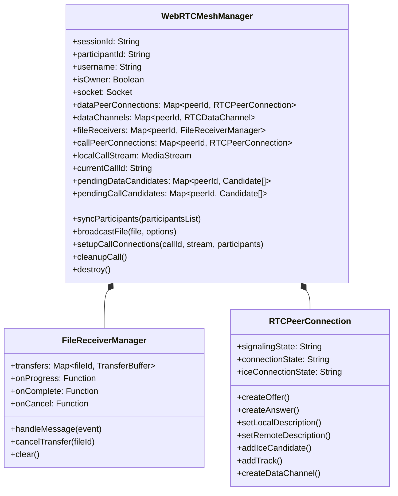

---

## 4. Master End-to-End System Flowchart

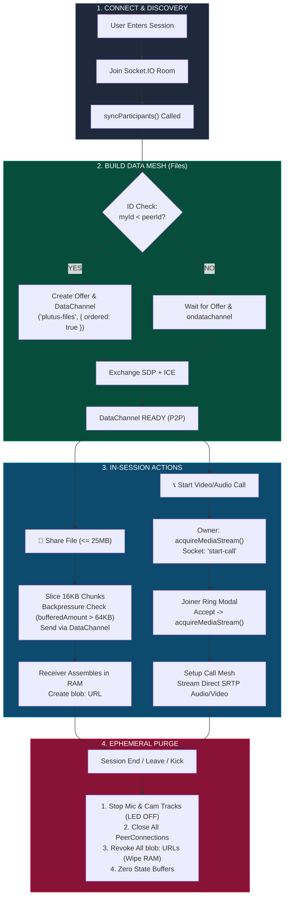

---

## 5. Network & NAT Traversal (STUN, ICE, and Candidate Gathering)

### What is NAT & Why STUN is Required
Devices on home Wi-Fi or cellular data reside behind private NATs (`192.168.x.x`). A STUN (Session Traversal Utilities for NAT) server acts as a public mirror to inform each peer of its public WAN IP and reflexive UDP port.

```mermaid
flowchart LR
    subgraph Local_LAN ["Peer A (Private Subnet)"]
        ClientA["Browser\n192.168.1.15:45201"]
        NAT_A["Router / NAT Gateway"]
    end

    subgraph Public_Internet ["Public Internet"]
        STUN["Google STUN Cluster\nstun.l.google.com:19302\nstun1.l.google.com:19302"]
        SigServer["Plutus Signaling Server\n(server.js)"]
    end

    subgraph Remote_LAN ["Peer B (Private Subnet)"]
        NAT_B["Router / NAT Gateway"]
        ClientB["Browser\n10.0.0.42:51200"]
    end

    ClientA -->|"1. UDP Binding Request"| NAT_A
    NAT_A -->|"2. Outgoing Packet (Public: 203.0.113.88:58421)"| STUN
    STUN -->|"3. Binding Response: 'Your IP is 203.0.113.88:58421'"| NAT_A
    NAT_A -->|"4. Deliver Reflected Address"| ClientA
    ClientA -->|"5. Send ICE Candidate via Socket"| SigServer
    SigServer -->|"6. Relay Candidate"| ClientB
    ClientA <══|"7. Direct P2P Media / Data Link Established"|══> ClientB

    style Local_LAN fill:#1e293b,stroke:#475569,color:#fff
    style Public_Internet fill:#0f172a,stroke:#334155,color:#fff
    style Remote_LAN fill:#1e293b,stroke:#475569,color:#fff
    style STUN fill:#0284c7,stroke:#fff,color:#fff
```

### STUN Configuration in `src/webrtc/config.js`
```javascript
export const RTC_CONFIG = {
  iceServers: [
    { urls: 'stun:stun.l.google.com:19302' },
    { urls: 'stun:stun1.l.google.com:19302' },
  ],
  iceCandidatePoolSize: 10,
};
```
* **`iceCandidatePoolSize: 10`:** Instructs the browser to pre-gather candidate pairs before connection initiation, cutting connection establishment latency to near zero.

---

## 6. Signaling Engine & SDP Negotiation Sequence

WebRTC uses **Session Description Protocol (SDP)** to negotiate media codecs (Opus, VP8), network ports, and cryptographic fingerprints (DTLS certificates).

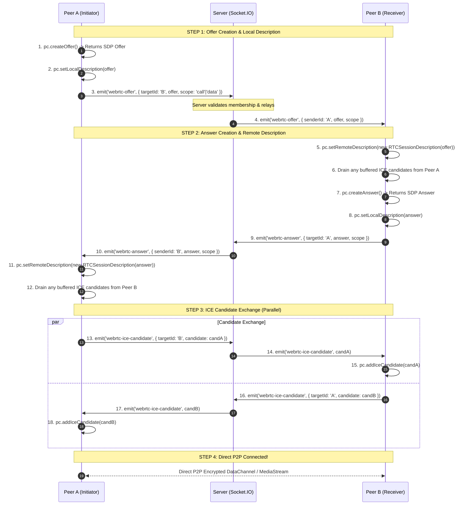

### Candidate Buffering (Race Condition Prevention)
If an ICE candidate arrives before `setRemoteDescription()` is executed, calling `pc.addIceCandidate()` directly causes an unhandled exception. Plutus buffers candidates in a queue:

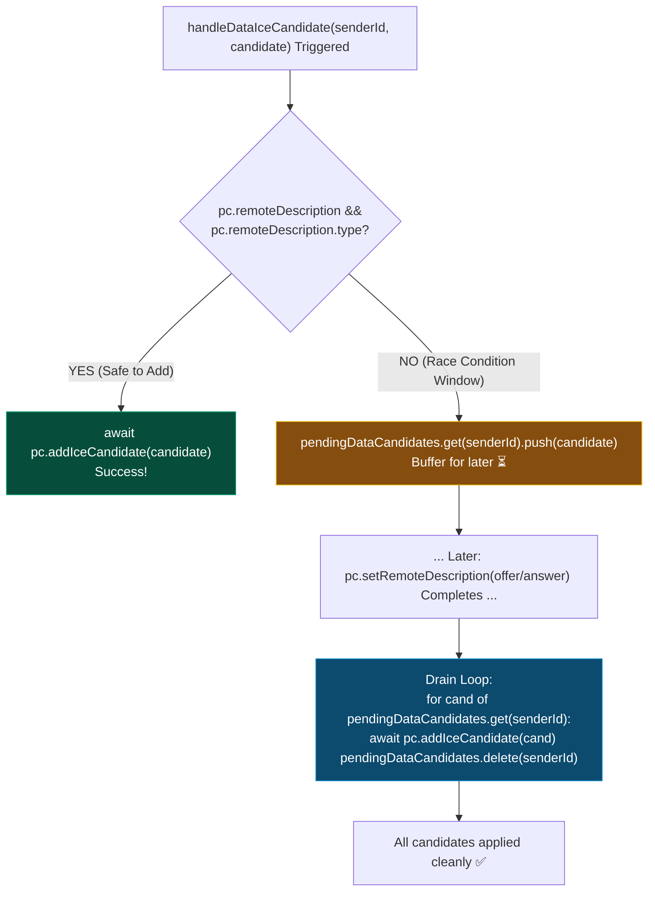

---

## 7. Deterministic Initiator & Perfect Negotiation (Glare Prevention)

### The Glare Problem
When two browsers discover each other simultaneously, both may fire `createOffer()` and transmit an SDP Offer. Both peer connections enter `have-local-offer`, resulting in an unrecoverable **Signaling Collision (Glare)**.

### The Solution: Deterministic Initiator Rule
Plutus Chat mathematically eliminates glare using lexicographical string comparison on unique participant IDs:

$$\text{Initiator} = (\text{myParticipantId} < \text{peerId})$$

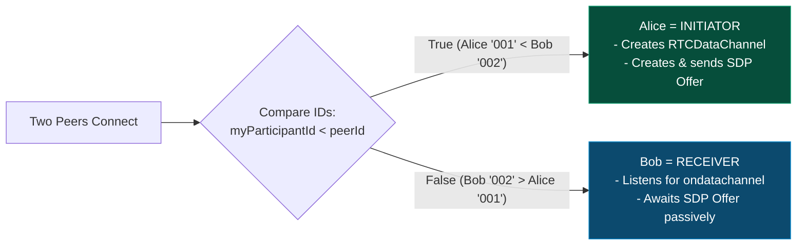

### The Polite Peer Pattern (W3C Standard)
For dynamic call connections where collisions could still theoretically happen, `meshManager.js` implements the **Polite Peer Pattern**:

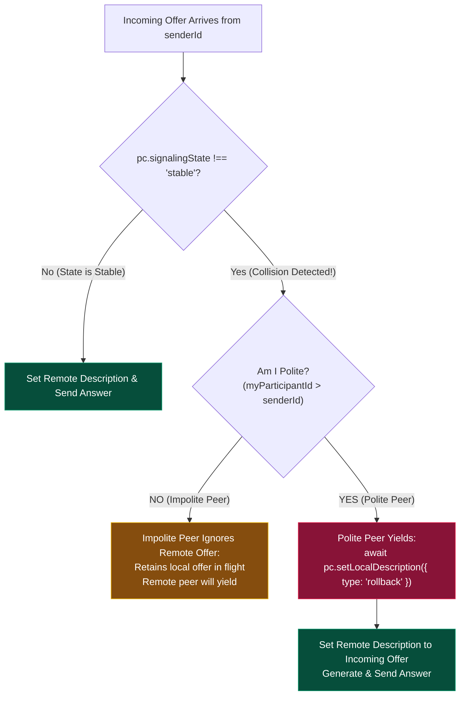

---

## 8. Audio & Video Calling Subsystem

### Media Engine & DSP Pipeline
Voice calls are acquired with hardware and browser Digital Signal Processing (DSP) enabled:
* `echoCancellation: true`: Cancels audio loops from speakers back into the microphone.
* `noiseSuppression: true`: Suppresses background hum, fan noise, and clicks.
* `autoGainControl: true`: Dynamically evens out microphone input levels.

### Automatic Audio-Only Fallback Flowchart

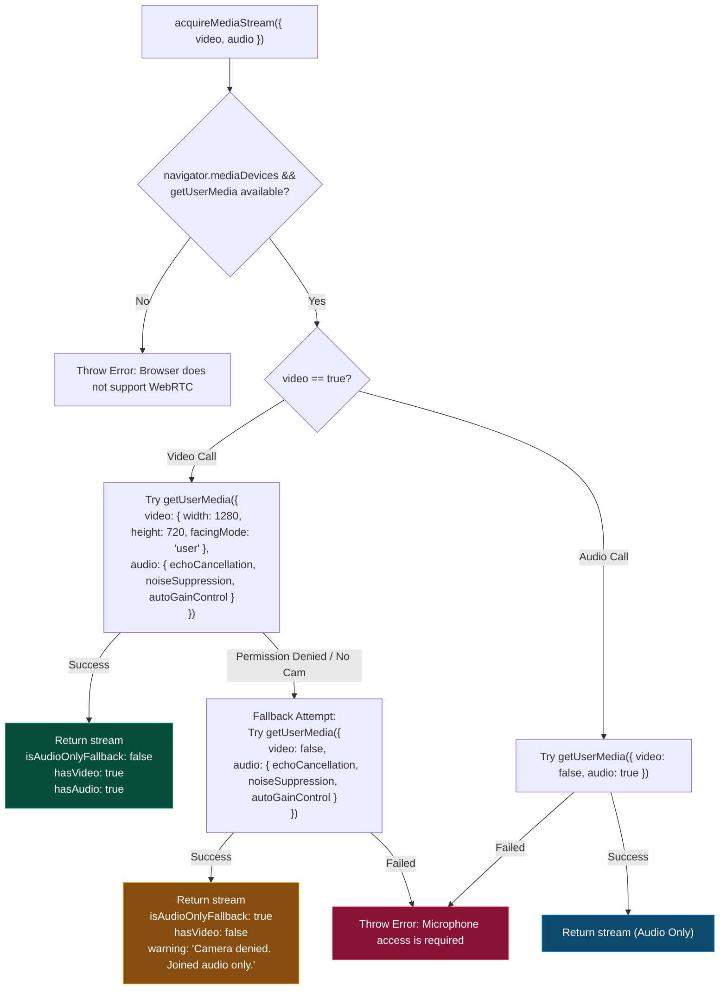

---

### Complete Call Lifecycle Sequence Flowchart

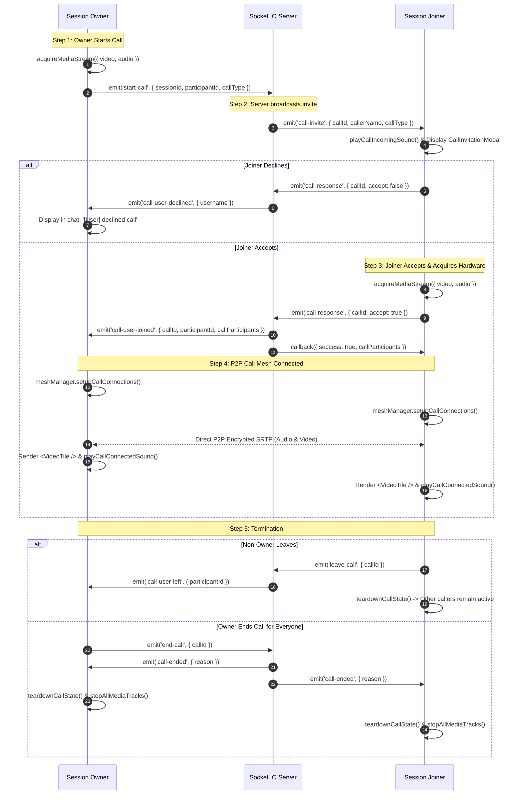

---

### In-Call Track Muting vs. SDP Renegotiation

```
Anti-Pattern (Slow & Fragile):
Mute Clicked ──► pc.removeTrack() ──► Create Offer ──► Renegotiate SDP ──► Audio Glitch / Lag

Plutus Pattern (Instant & Seamless):
Mute Clicked ──► track.enabled = false ──► Browser outputs silence packets ──► Zero connection lag!
```

```javascript
// src/webrtc/mediaManager.js
export function setAudioEnabled(stream, enabled) {
  if (!stream) return false;
  stream.getAudioTracks().forEach((track) => {
    track.enabled = Boolean(enabled); // Instant hardware silence toggle
  });
  return audioTracks.some((t) => t.enabled);
}
```

---

### Call State Machine & Multi-Party Mesh Coordination

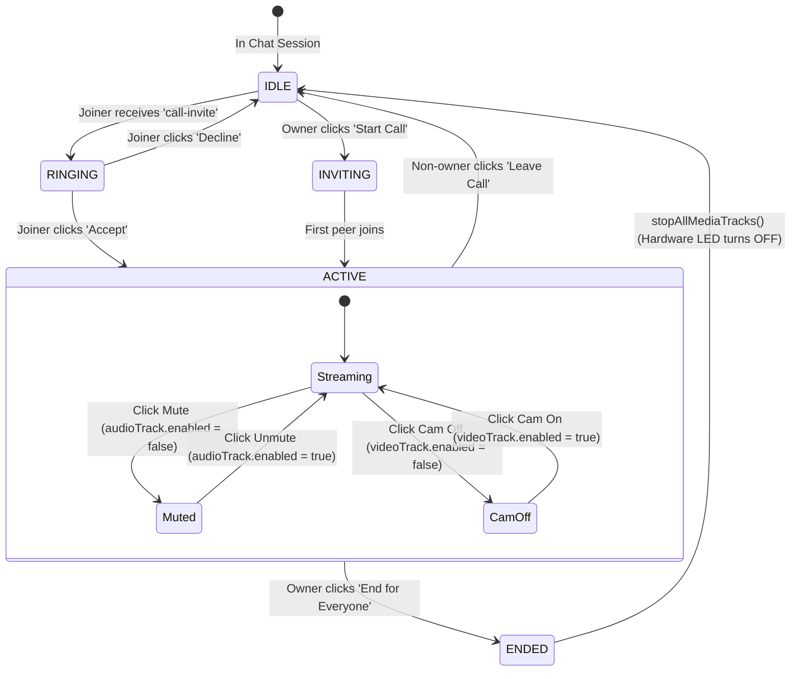

---

## 9. P2P File Transfer Protocol & Streaming Engine

### SCTP DataChannel Framing & Packet Structure
Plutus streams files directly browser-to-browser over `RTCDataChannel` (`{ ordered: true }`):

```
┌─────────────────────────────────────────────────────────────────────────────┐
│ 1. Header Frame (JSON String)                                               │
│ { "type": "file-start", "fileId": "uuid", "fileName": "doc.pdf", ... }      │
├─────────────────────────────────────────────────────────────────────────────┤
│ 2. Binary Chunk 1 (ArrayBuffer - 16 KB)                                     │
├─────────────────────────────────────────────────────────────────────────────┤
│ 3. Binary Chunk 2 (ArrayBuffer - 16 KB)                                     │
├─────────────────────────────────────────────────────────────────────────────┤
│ ... Binary Chunks N (ArrayBuffer - 16 KB)                                   │
├─────────────────────────────────────────────────────────────────────────────┤
│ 4. Completion Frame (JSON String)                                           │
│ { "type": "file-end", "fileId": "uuid" }                                    │
└─────────────────────────────────────────────────────────────────────────────┘
```

---

### 16 KB Chunking & Flow Control (Backpressure)

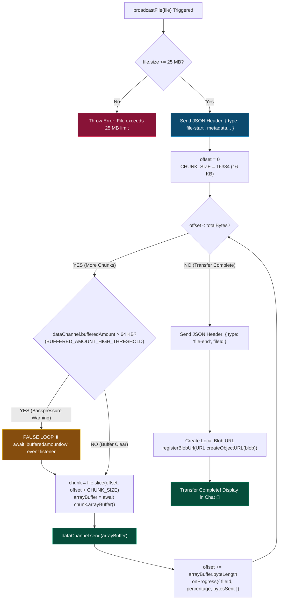

### Backpressure Analogy
```
[File on NVMe Disk] ──(Fast Pour: 500 MB/s)──► ┌────────────────┐
                                                │  64 KB Buffer  │ ◄── Throttles disk read if network is slow
                                                └───────┬────────┘
                                                        │ (Safe 16 KB Drops: 5 MB/s)
                                                        ▼
                                                [Receiver Browser]
```

---

### Receiver Assembly & Blob Reconstruction

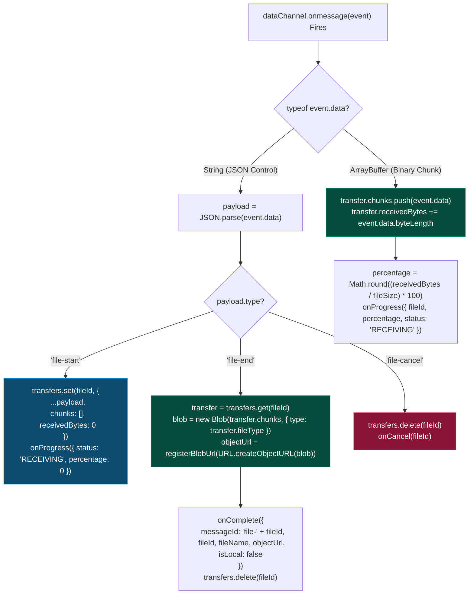

---

## 10. React State Coordination & Stale-Closure Prevention

Socket.IO listeners in React can easily suffer from **stale closures** (referencing old state values from initial render).

`App.jsx` uses a **Dual State + Ref Pattern**:

```javascript
// src/App.jsx
const [callState, setCallState] = useState('IDLE');
const callStateRef = useRef('IDLE');

// Synchronize ref whenever state updates
useEffect(() => {
  callStateRef.current = callState;
}, [callState]);

// Socket callback always accesses fresh ref without re-binding listener:
const handleCallUserJoined = (data) => {
  if (callStateRef.current === 'ACTIVE') {
    meshManagerRef.current.initiateCallPeerConnection(data.participantId, data.callId);
  }
};
```

---

## 11. Connection State Lifecycle & Failure Recovery

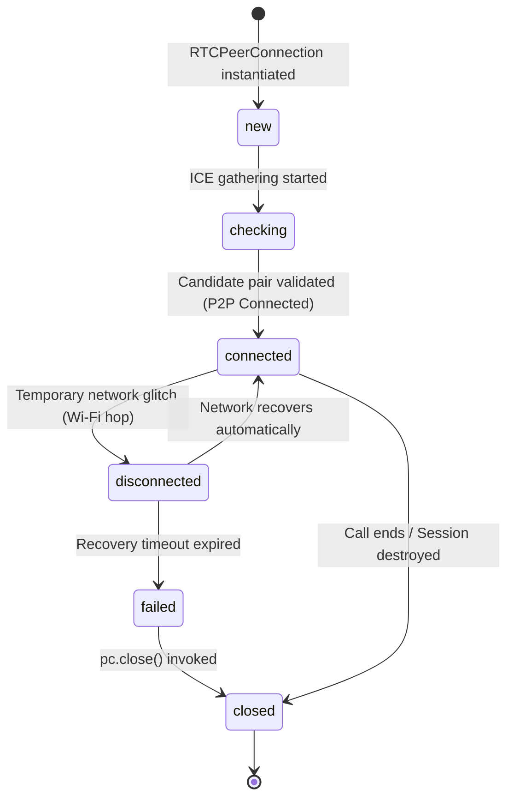

When `connectionState` transitions to `failed` or `closed`, `meshManager.js` removes the peer connection and cleans up all associated data channels and queues.

---

## 12. Ephemeral Security & Zero-Persistence Memory Purge

Plutus provides strict ephemerality. Closing a session triggers a 4-stage cleanup:

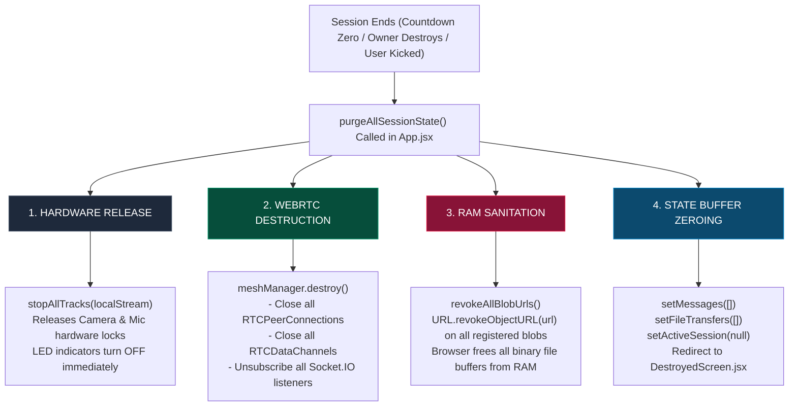

---

## 13. Complete Signaling Event & Wire Payload Reference

| Socket Event | Sender | Receiver | Scope | Payload Schema |
| :--- | :--- | :--- | :--- | :--- |
| `start-call` | Owner | Server | Session | `{ sessionId, participantId, callType: 'video'\|'audio' }` |
| `call-invite` | Server | Joiners | Session | `{ callId, callerName, callType }` |
| `call-response` | Joiner | Server | Session | `{ sessionId, participantId, callId, accept: Boolean }` |
| `call-user-joined` | Server | Call Peers | Call | `{ callId, participantId, username, callParticipants: [] }` |
| `call-user-declined`| Server | Owner | Session | `{ callId, participantId, username }` |
| `leave-call` | Joiner | Server | Call | `{ sessionId, participantId, callId }` |
| `end-call` | Owner | Server | Call | `{ sessionId, participantId, callId }` |
| `call-ended` | Server | All Peers | Call | `{ callId, reason }` |
| `webrtc-offer` | Peer A | Peer B | Direct | `{ sessionId, senderId, targetId, offer, callId, scope: 'call'\|'data' }` |
| `webrtc-answer` | Peer B | Peer A | Direct | `{ sessionId, senderId, targetId, answer, callId, scope: 'call'\|'data' }` |
| `webrtc-ice-candidate`| Peer | Peer | Direct | `{ sessionId, senderId, targetId, candidate, callId, scope: 'call'\|'data' }` |

---

## 14. Codebase File Tour & Architectural Roles

```
src/
├── webrtc/
│   ├── config.js         ⚙️ STUN list, 25MB MAX_FILE_SIZE, 16KB CHUNK_SIZE, 64KB buffer threshold
│   ├── mediaManager.js   🎥 getUserMedia, auto-fallback, setAudioEnabled, stopAllMediaTracks
│   ├── fileTransfer.js   📦 16KB chunk streaming, backpressure flow loop, Blob URL memory registry
│   └── meshManager.js    🕸️ Dual-mesh coordinator (syncParticipants, broadcastFile, setupCallConnections)
│
├── components/
│   ├── Call/
│   │   ├── CallWindow.jsx          🖥️ Grid UI layout, call duration timer, Mute/Cam toggle buttons
│   │   ├── VideoTile.jsx           👤 Individual video/audio tile with avatar & status badges
│   │   └── CallInvitationModal.jsx 🔔 Incoming call prompt with audio ringtone (Accept/Decline)
│   └── File/
│       ├── FileUploadButton.jsx    📎 File picker with 25MB validation and progress wheel
│       └── FileMessage.jsx         🖼️ In-chat image lightbox, PDF viewer, download anchor
│
└── server.js             📡 Socket.IO signaling relays (webrtc-offer, webrtc-answer, webrtc-ice-candidate)
```

---

## 🏁 Developer Rules of Thumb

1. **Zero Media on Server:** Never relay or buffer audio/video/file buffers through server memory or database.
2. **Deterministic Initiator:** Maintain the `participantId_A < participantId_B` rule in any signaling modification to prevent offer collision.
3. **Respect Backpressure:** Always verify `dataChannel.bufferedAmount > 64KB` before dispatching subsequent binary chunks.
4. **Always Revoke Object URLs:** Any call to `URL.createObjectURL()` must register the URL with `registerBlobUrl()` for session-destruction RAM purge.
5. **Always Stop Tracks:** Never just nullify a `MediaStream`; always call `track.stop()` to release user hardware cameras and microphones.
