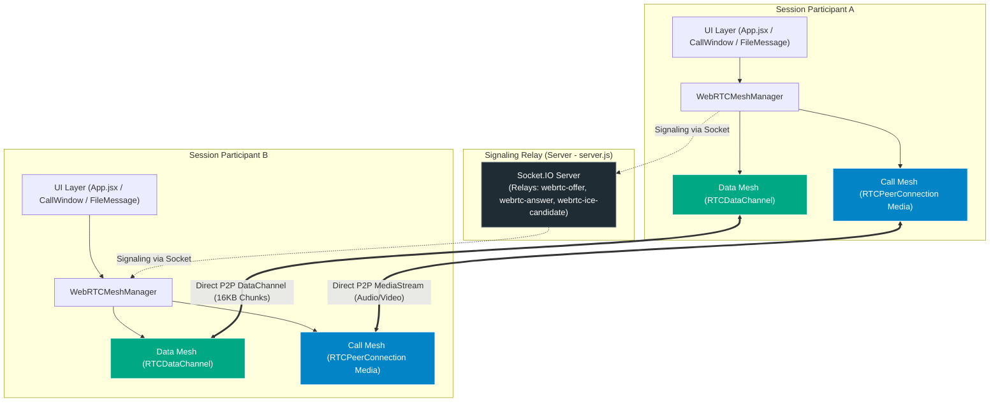
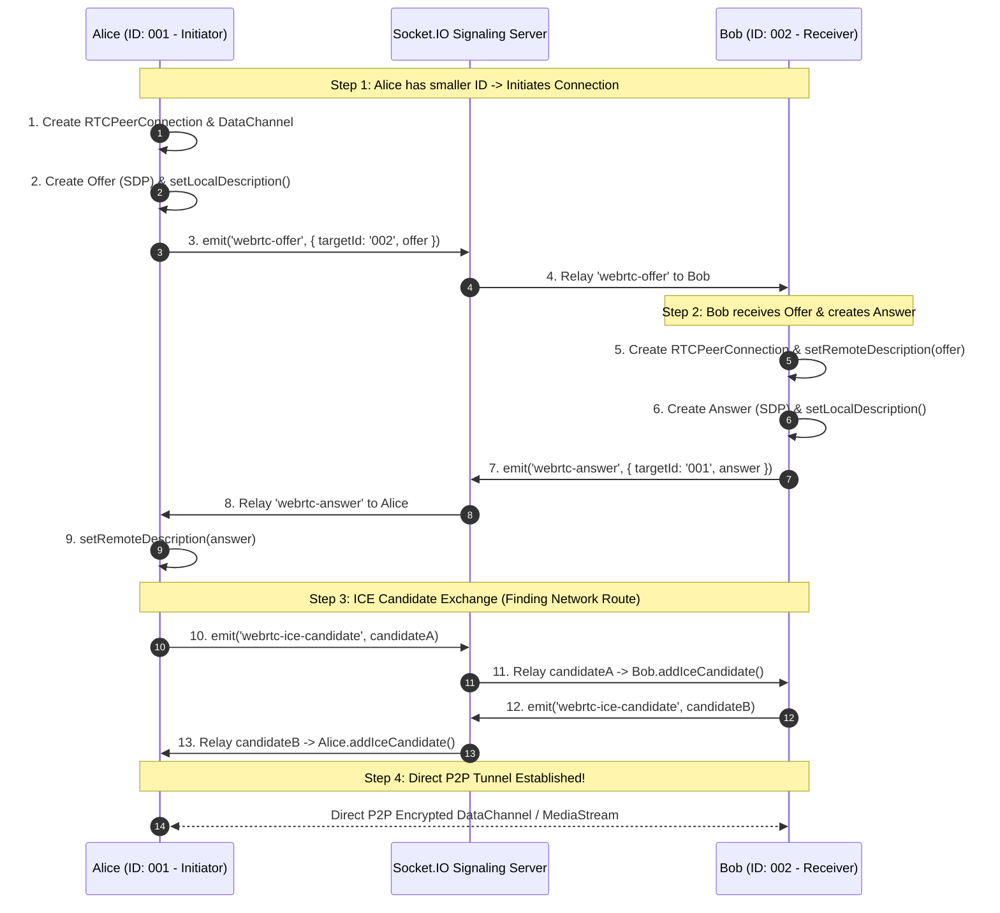
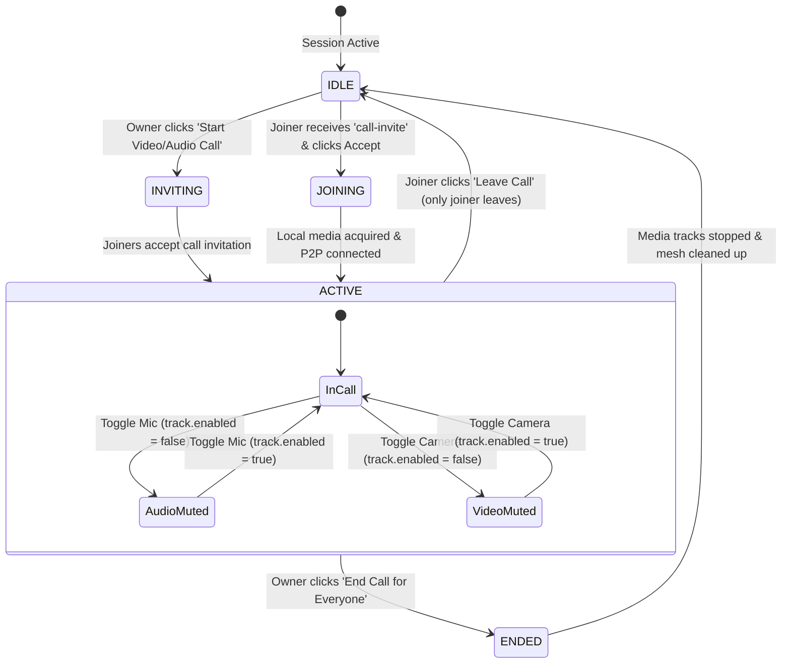
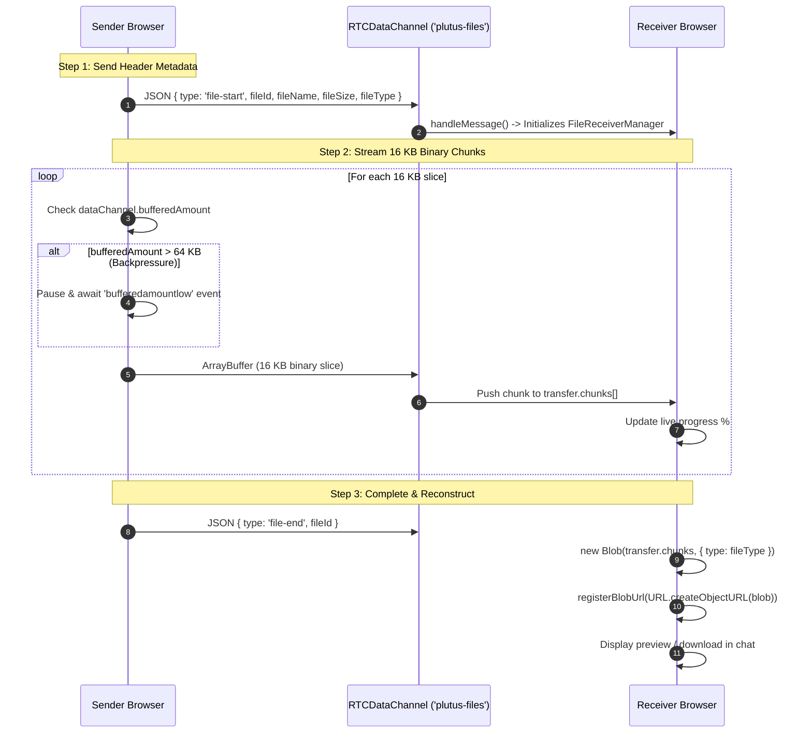

# 🌐 WebRTC Complete Architecture & Implementation Guide
**Plutus Secure Communication Line — WebRTC Subsystem**

---

## ⚡ 1. WebRTC in 60 Seconds (The Big Picture)

**WebRTC (Web Real-Time Communication)** allows web browsers to talk **directly to each other (Peer-to-Peer / P2P)** without passing audio, video, or files through a central server.

```
       ┌────────────────────────────────────────────────────────┐
       │             Socket.IO Signaling Server                 │
       │    (Only introduces peers; never touches media/files)  │
       └──────────────┬──────────────────────────┬──────────────┘
         Signaling:   │ Offers / Answers / ICE   │  Signaling:
         SDP & ICE    ▼                          ▼  SDP & ICE
                 ┌──────────┐              ┌──────────┐
                 │ Client A │◄────────────►│ Client B │
                 │ (Browser)│  Direct P2P  │ (Browser)│
                 └──────────┘  Encrypted   └──────────┘
                               Media & Files
```

### 🔒 Core Ephemeral Guarantee
* **Zero Server Storage:** No audio, video frames, or file data ever pass through or touch the Node.js backend.
* **Direct Encryption:** Media streams use DTLS-SRTP encryption, and data channels use SCTP over DTLS.
* **Instant In-Memory Cleanup:** When a call ends or a session is destroyed, all media tracks stop immediately and temporary object memory URLs (`blob:`) are completely revoked.

---

## 🚀 2. Key Features

| Feature | Description | Technical Implementation |
| :--- | :--- | :--- |
| **P2P Video Calling** | HD (720p @ 1280x720) bidirectional video calls between session members. | `RTCPeerConnection` + `MediaStream` + `navigator.mediaDevices.getUserMedia` |
| **P2P Audio Calling** | Crisp voice calls with noise suppression, echo cancellation, and auto-gain. | `audio: { echoCancellation: true, noiseSuppression: true, autoGainControl: true }` |
| **Camera Fallback** | If a user lacks a camera or denies permission, automatically drops to audio-only. | Automatic fallback in `acquireMediaStream()` |
| **Live Call Controls** | Mute/unmute microphone, toggle camera on/off, call duration timer. | `track.enabled = false/true` (preserves connection without renegotiation) |
| **Call Management** | Owner can initiate or end calls for everyone; joiners can leave anytime. | Role-enforced Socket.IO signaling events |
| **P2P File Transfer** | Share images, PDFs, and files up to **25 MB** directly browser-to-browser. | `RTCDataChannel` (`plutus-files`, `{ ordered: true }`) |
| **Chunking & Flow Control** | Splits files into 16 KB chunks with 64 KB backpressure buffer control. | `bufferedAmount` & `bufferedamountlow` event loop |
| **Memory Purge** | Blob URLs created for files/previews are tracked and revoked upon cleanup. | `URL.revokeObjectURL()` via `FileReceiverManager` & `meshManager.destroy()` |

---

## 🏗️ 3. Architecture & The Dual-Mesh System

Plutus Chat runs **two distinct, parallel WebRTC meshes**:



### 1. Data Mesh (`plutus-files`)
* **Lifespan:** Starts as soon as two or more users are in the session; stays open while users are chatting.
* **Purpose:** High-speed, peer-to-peer file, image, and PDF transfer.
* **Structure:** A full peer-to-peer mesh between every participant pair.

### 2. Call Mesh (Audio & Video)
* **Lifespan:** Created on-demand when the owner initiates a call, torn down when the call ends.
* **Purpose:** Real-time bi-directional audio/video streaming.
* **Structure:** Multi-peer mesh where each participant creates an `RTCPeerConnection` to every other participant in the call.

---

## 🔄 4. How WebRTC Signaling Works (Step-by-Step)

WebRTC peers need to find each other and negotiate media codecs before they can connect directly. This introduction is called **Signaling**.

### 🧩 Glare Prevention & The Deterministic Initiator Rule
When two peers connect simultaneously, both might try sending an offer at the same time (called **WebRTC Glare / Collision**).

Plutus Chat solves this with a **Deterministic Initiator Pattern**:
> **Rule:** The participant with the **lexicographically smaller ID** (`participantId_A < participantId_B`) creates and sends the Offer. The participant with the larger ID waits and answers.



---

## 📞 5. Audio / Video Calling Lifecycle



### Call Lifecycle Details

1. **Initiation (`App.jsx -> handleStartCall`):**
   * Owner clicks Video or Audio Call.
   * Calls `acquireMediaStream({ video, audio })` to access camera/mic.
   * Emits `start-call` over Socket.IO.
   * Server validates owner status and broadcasts `call-invite` to all participants.

2. **Invitation Modal (`CallInvitationModal.jsx`):**
   * Ringtone audio plays (`playCallIncomingSound()`).
   * Joiner can click **Accept** or **Decline**.
   * If declined, owner receives a notice (`call-user-declined`).

3. **Media Connection (`meshManager.js -> setupCallConnections`):**
   * Local audio/video tracks are attached (`pc.addTrack(track, stream)`).
   * WebRTC Offer/Answer handshake runs across all call participants.
   * Remote tracks arrive via `pc.ontrack` and render in `<VideoTile />` components.

4. **In-Call Track Controls (`mediaManager.js`):**
   * **Mute Mic:** `setAudioEnabled(stream, false)` sets `track.enabled = false`.
   * **Toggle Cam:** `setVideoEnabled(stream, false)` sets `track.enabled = false`.
   * *Why this is fast:* It disables transmission without breaking or renegotiating the `RTCPeerConnection`.

5. **Teardown & Cleanup (`meshManager.js -> cleanupCall`):**
   * Calls `track.stop()` on all local audio and video tracks (releasing the browser hardware lock/LED immediately).
   * Closes all call `RTCPeerConnection` instances and clears remote streams.

---

## 📁 6. P2P File Transfer Protocol & Flow Control

Files are shared directly browser-to-browser over WebRTC DataChannels using a custom binary chunking protocol.



### ⚙️ File Transfer Specifications

| Parameter | Value | Rationale |
| :--- | :--- | :--- |
| **Max File Size** | `25 MB` (`25 * 1024 * 1024` bytes) | Keeps browser memory usage safe while allowing high-res photos and documents. |
| **Chunk Size** | `16 KB` (`16384` bytes) | Optimal MTU size for SCTP data channels, preventing packet fragmentation. |
| **Backpressure Threshold** | `64 KB` (`65536` bytes) | Prevents browser memory overflow if the receiver's network is slower than the sender's disk read. |
| **Channel Mode** | `{ ordered: true }` | Guarantees chunks arrive in exact order so files reconstruct without corruption. |

---

## 🗂️ 7. Codebase File Map & Responsibilities

```
src/webrtc/
├── config.js          # STUN server list, file limits (25MB), chunk size (16KB), call states
├── mediaManager.js    # Camera/Mic acquisition, auto-fallback, track muting, track stop
├── fileTransfer.js    # 16KB chunking protocol, backpressure handling, Blob URL registry
└── meshManager.js     # Dual-mesh orchestrator (DataChannel Mesh & Call Media Mesh)

src/components/
├── Call/
│   ├── CallWindow.jsx          # Collapsible call container, grid layout, call timer, controls
│   ├── VideoTile.jsx           # Individual video/audio tile with avatar & status badges
│   └── CallInvitationModal.jsx # Incoming call ring modal (Accept / Decline)
└── File/
    ├── FileUploadButton.jsx    # File picker with 25MB validation and progress wheel
    └── FileMessage.jsx         # Chat message tile for images, PDFs, files with preview & download

server.js              # Socket.IO signaling relays (webrtc-offer, webrtc-answer, webrtc-ice-candidate)
```

---

## 💡 8. Summary & Quick Reference

1. **Signaling Server:** The server (`server.js`) only matches peers via Socket.IO events (`webrtc-offer`, `webrtc-answer`, `webrtc-ice-candidate`).
2. **Deterministic Role:** Peer with smaller ID initiates offers to prevent connection collisions.
3. **Audio/Video:** Streams directly peer-to-peer with hardware controls and silent audio fallback.
4. **File Sharing:** Files are split into 16 KB chunks over `RTCDataChannel` with backpressure control and zero server footprint.
5. **Ephemerality:** When the session closes, all hardware tracks stop and in-memory Blob URLs are immediately revoked.
